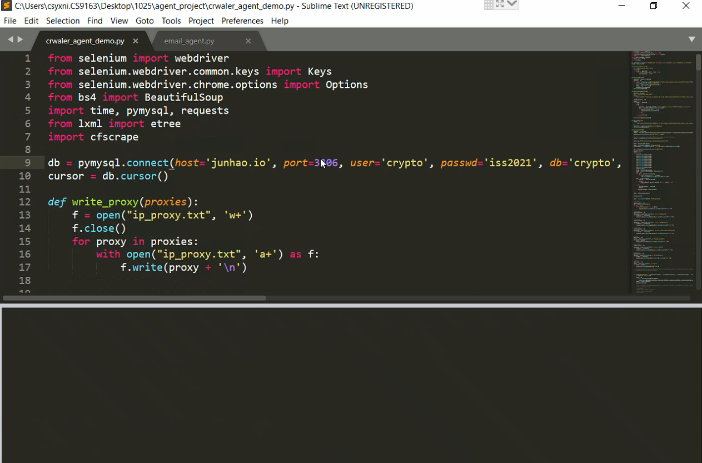
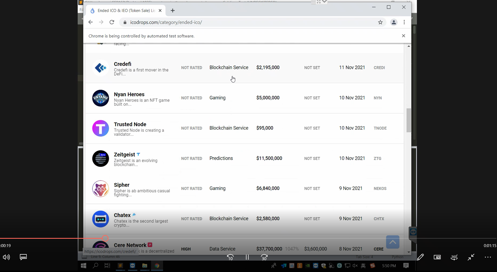

### [ Practice Module ] ISA-PM-IPA-2021-09-01-ISY5005-GRP-AgentSG-Multi_Agent_System

---

### <<<<<<<<<<<<<<<<<<<< Start of Project >>>>>>>>>>>>>>>>>>>>

---

## SECTION 1 : Movie Recommendation System

---

## SECTION 2 : EXECUTIVE SUMMARY 
Due to the Internet has the characteristics of open information exchange, bidirectionality of information transmission, and extensive information coverage, the amount of information in the network expands and increases exponentially, and the problem of information overload and information trek on the network is becoming more and more serious.

Solving these problems, the key is to transform the Internet from passively accepting the requests of viewers to actively perceiving the information needs of viewers, and to realize the active information service of the network system to the viewers. In order to provide people with satisfactory information and services, the recommendation technology has emerged as the times require. 

---

## SECTION 3 : CREDITS / PROJECT CONTRIBUTION

| Official Full Name  | Student ID (MTech Applicable)  | Work Items (Who Did What) | Email (Optional) |
| :------------ |:---------------:| :-----| :-----|
| Wu Yichen(leader) | A0231544M | 1. Web UI designer 2. Model designer | e0703576@u.nus.edu |
| Zeng Zijing | A0231548E | 1. Database designer  2. Model designer | zengzijing1@163.com |

---

## SECTION 4 : VIDEO OF SYSTEM MODELLING & USE CASE DEMO

`Refer to project report at Github Folder: video` 

---

## SECTION 5 : USER GUIDE

### [ 1 ] Install project dependencies:

> **In order to ensure the stable operation of the system, the following dependencies are all used stable versions.**
>
> **(1) Python 3.6+**
>
> **Library requirements: smtplib, email, matplotlib.
>
> **Environment requirement: install texlive locally and add the environment variables to the path
> 
> **Receive emails: the receivers are set in row 32 of “email_agent.py”, you can change the value to your own email, e.g., recipientAddrs = ‘email1;email2;email3’.
> 
### [ 2 ] To run our multi agent system:
> **(1) Run “Git clone https://github.com/Yichen-Wu-90408/ISA_Agent.git” to download the project and unzip it, then change the directory to the root of our project folder.
> 
> **(2) Run the command “python crwaler_agent.py” to start the crawler and upload the data to the database (it will link to our established database). 
Library requirements: selenium, bs4, pymysql, requests, lxml, cfscrape.
You can set it to run regularly, e.g., once an hour.
>
> **(3) Run the command “python email.agent.py”. It will start the “pdf_agent.py” to generate an industry report based on the crawler data and the latex template, then the “email_agent.py” would send the pdf file to users through email.
> 

## SECTION 6 : PROJECT REPORT 

`Refer to project report at Github Folder: ProjectReport`

**Recommended Sections for Project Report:**

- Background
- Research on Existing Recommender System
- Analysis of Problems in China’s Movie Recommendation System
- Commercial Value of the Project
- System Design
- Operating Environment
- User Guide

---

### <<<<<<<<<<<<<<<<<<<< End of Project >>>>>>>>>>>>>>>>>>>>

---

